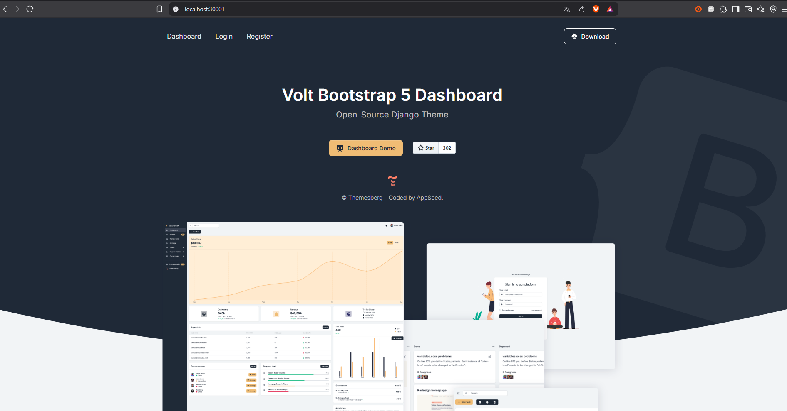
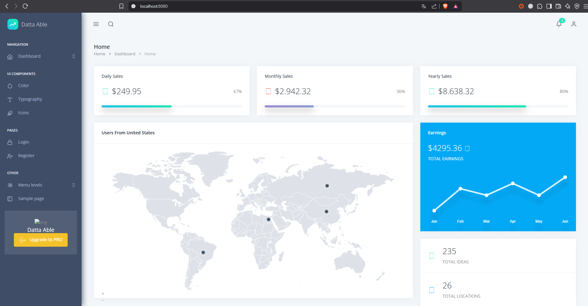
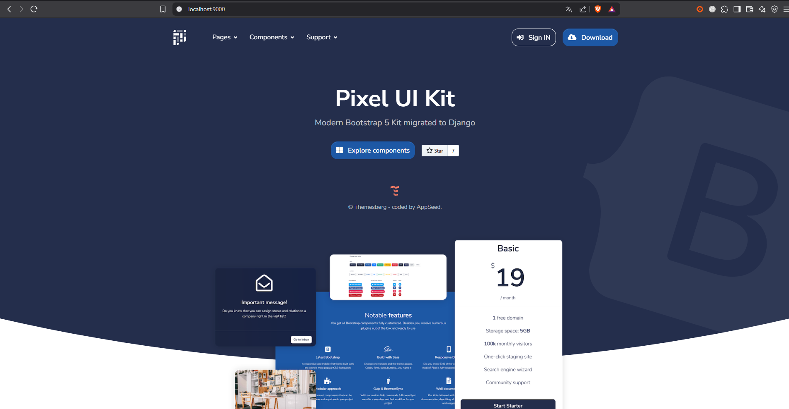
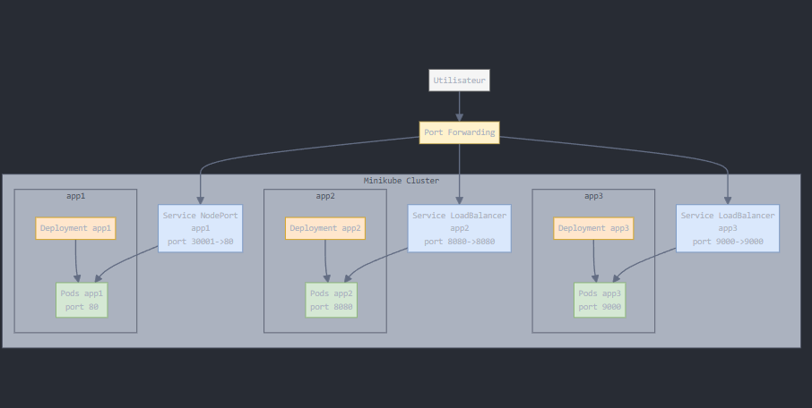

# Maquette Kubernetes - Déploiement de 3 Applications (Django incluse)

Ce dépôt présente une maquette fonctionnelle de migration vers Kubernetes pour un client ayant 3 applications à exposer sur les ports 80, 8080 et 9090. L'une d'elles est critique, développée avec Django.

## 🎯 Objectifs

- Containeriser les 3 applications avec Docker, en **optimisant les images**.
- Déployer 3 applications dans **Kubernetes** avec :
  - Un **Deployment**
  - Un **Service**
  - **Au moins un Ingress**
- Séparer **chaque composant** dans un manifeste distinct.
- Permettre un **accès externe** aux applications.

## Qu'est-ce que Kubernetes ?

Kubernetes est un système open-source de gestion de conteneurs qui automatise le déploiement, la mise à l'échelle et la gestion des applications conteneurisées. Il permet de gérer des clusters de machines virtuelles ou physiques, en orchestrant le déploiement et la mise à l'échelle des applications dans des environnements distribués.

## Qu'est-ce que Minikube ?

Minikube est un outil qui facilite l'exécution de Kubernetes localement. Il crée un cluster Kubernetes à une seule machine virtuelle sur votre ordinateur, ce qui permet de tester et de développer des applications conteneurisées sans avoir besoin d'un environnement de production complet.

## Qu'est-ce que Docker ?

Docker est une plateforme de conteneurisation qui permet de créer, déployer et exécuter des applications dans des conteneurs. Un conteneur est une unité standardisée de logiciel qui regroupe le code de l'application et toutes ses dépendances, garantissant ainsi que l'application fonctionne de manière cohérente sur différents environnements.

## Structure du dépôt

```
k8s-maquette/
│
├── apps/
│   ├── app1/ (port 80)
│   ├── app2/ (port 8080)
│   └── app3/ (port 9000)
│
├── k8s/
│   ├── app1-deployment.yaml
│   ├── app1-service.yaml
│   ├── app2-deployment.yaml
│   ├── app2-service.yaml
│   ├── app3-deployment.yaml
│   ├── app3-service.yaml
│   ├── app3-ingress.yaml
```
## Les objets Kubernetes

- **Pod** : Unité de base de Kubernetes, représentant un ou plusieurs conteneurs qui partagent le même réseau et le même stockage.

- **Deployment** : Gère la création et la mise à jour des Pods, garantissant que le nombre spécifié de Pods est en cours d'exécution à tout moment.

- **Service** : Permet de définir une politique d'accès aux Pods, en exposant une interface réseau stable pour accéder à un ensemble de Pods.

- **Ingress** : Gère l'accès externe aux services dans un cluster, en fournissant des règles de routage HTTP et HTTPS.

- **IngressController** : Composant qui gère les Ingress, en configurant un équilibreur de charge pour diriger le trafic vers les services appropriés.

- **ReplicaSet** : Assure qu'un nombre spécifié de répliques d'un Pod est en cours d'exécution à tout moment.

- **ConfigMap** : Permet de stocker des données de configuration sous forme de paires clé-valeur, qui peuvent être utilisées par les Pods.

- **Secret** : Similaire à ConfigMap, mais conçu pour stocker des données sensibles, comme des mots de passe ou des clés d'API.


## Service

Permet de définir une politique d'accès aux Pods, en exposant une interface réseau stable pour accéder à un ensemble de Pods.

### Les types de Service Kubernetes

Kubernetes propose plusieurs types de services pour exposer les applications déployées dans un cluster. Voici les trois principaux types de services utilisés dans ce projet :

#### 1. **ClusterIP**
- **Description** : C'est le type de service par défaut. Il expose le service à l'intérieur du cluster Kubernetes, permettant aux autres pods du cluster d'y accéder.
- **Cas d'utilisation** : Idéal pour les communications internes entre les applications ou les microservices dans le cluster.
- **Exemple** : Si une application front-end doit communiquer avec une API back-end dans le même cluster, un service de type ClusterIP peut être utilisé.

#### 2. **NodePort**
- **Description** : Ce type de service expose une application sur un port spécifique de chaque nœud du cluster. Cela permet d'accéder à l'application depuis l'extérieur du cluster en utilisant l'adresse IP du nœud et le port exposé.
- **Cas d'utilisation** : Utile pour des tests ou des environnements de développement où un accès direct à l'application est nécessaire.
- **Exemple dans ce projet** : App1 (Django) est exposée via un service NodePort sur le port `30001`.

#### 3. **LoadBalancer**
- **Description** : Ce type de service crée automatiquement un équilibreur de charge externe (si pris en charge par le fournisseur de cloud) pour distribuer le trafic vers les pods associés. Il attribue également une adresse IP externe pour accéder au service.
- **Cas d'utilisation** : Idéal pour les environnements de production où un accès externe fiable et équilibré est requis.
- **Exemple dans ce projet** : App2 (Flask) et App3 (Django) sont exposées via des services LoadBalancer.

### Comparaison des types de services

| Type de Service | Port Exposé | Accès Externe | Cas d'Utilisation             |
|------------------|-------------|---------------|--------------------------------|
| **ClusterIP**    | Non         | Non           | Communication interne         |
| **NodePort**     | Oui         | Oui           | Accès direct pour tests ou développement |
| **LoadBalancer** | Oui         | Oui           | Accès externe en production   |

Ces services permettent de répondre à différents besoins en fonction des scénarios d'utilisation et des environnements.

## Installation et configuration de Minikube

### 1. Installer Kubernetes

#### Prérequis

Avant de commencer l'installation, assurez-vous d'avoir:

- 2 CPU ou plus
- 2GB de mémoire libre
- 20GB d'espace disque libre
- Une connexion Internet
- Un gestionnaire de conteneurs ou de machines virtuelles comme Docker, QEMU, Hyperkit, Hyper-V, KVM, Parallels, Podman, VirtualBox, ou VMware Fusion/Workstation

#### Installation de Minikube

Pour installer la dernière version stable de Minikube sur Linux x86-64 avec une installation binaire:

```bash
curl -LO https://storage.googleapis.com/minikube/releases/latest/minikube-linux-amd64
sudo install minikube-linux-amd64 /usr/local/bin/minikube
```

### 2. Créer le cluster avec Docker

Vérifiez les versions de Kubernetes compatibles avec Minikube en affichant les paramètres par défaut de la configuration Minikube. Cela permet de s'assurer que la version de Kubernetes utilisée est supportée par votre installation actuelle de Minikube :

```bash
minikube config defaults kubernetes-version
```

Cette commande retourne la version par défaut de Kubernetes que Minikube utilise, ainsi que les versions compatibles. Si vous souhaitez utiliser une version spécifique, vous pouvez la définir lors de la création du cluster avec l'option `--kubernetes-version`.

### 2.1. Créer votre cluster Minikube avec Docker

Pour démarrer un cluster Minikube en utilisant Docker comme backend, exécutez la commande suivante :

```bash
minikube start --listen-address=0.0.0.0 --memory=max --cpus=max --kubernetes-version=v1.32.0
```

#### Détails des options utilisées :
- `--listen-address=0.0.0.0` : Permet à Minikube d'écouter sur toutes les interfaces réseau, ce qui est utile pour accéder au cluster depuis d'autres machines sur le réseau.
- `--memory=max` : Alloue la quantité maximale de mémoire disponible à Minikube, garantissant ainsi des performances optimales pour le cluster.
- `--cpus=max` : Alloue tous les cœurs CPU disponibles à Minikube, ce qui est particulièrement utile pour les charges de travail intensives.
- `--kubernetes-version=v1.32.0` : Spécifie la version de Kubernetes à utiliser pour le cluster. Assurez-vous que cette version est compatible avec vos applications et configurations.

#### Exemple de sortie attendue :
Après avoir exécuté cette commande, vous devriez voir une sortie similaire à celle-ci :

```bash
😄  minikube v1.30.0 on Linux
✨  Using the docker driver based on user configuration
👍  Starting control plane node minikube in cluster minikube
🔥  Creating docker container (CPUs=max, Memory=max) ...
🐳  Preparing Kubernetes v1.32.0 on Docker 20.10.17 ...
🔎  Verifying Kubernetes components...
🌟  Enabled addons: default-storageclass, storage-provisioner
🏄  Done! kubectl is now configured to use "minikube" cluster and "default" namespace by default
```

#### Vérification du cluster :
Une fois le cluster démarré, vous pouvez vérifier son état avec les commandes suivantes :

```bash
minikube status
```

Cette commande affiche l'état actuel de votre cluster Minikube, y compris les informations sur le nœud, le gestionnaire de conteneurs utilisé, et si les composants Kubernetes essentiels (comme le serveur API) sont en cours d'exécution. Exemple de sortie :

```bash
host: Running
kubelet: Running
apiserver: Running
kubeconfig: Configured
```

```bash
kubectl cluster-info
```

Cette commande fournit des informations détaillées sur le cluster Kubernetes, notamment l'URL du serveur API et l'état des composants principaux. Exemple de sortie :

```bash
Kubernetes control plane is running at https://127.0.0.1:6443
CoreDNS is running at https://127.0.0.1:6443/api/v1/namespaces/kube-system/services/kube-dns:dns/proxy
```

Ces commandes permettent de s'assurer que le cluster est correctement configuré et opérationnel avant de déployer vos applications.

Ces commandes confirment que le cluster est opérationnel et prêt à être utilisé.

Vérifiez l'IP du cluster Minikube:

```bash
minikube ip
```

Cette commande retourne l'adresse IP attribuée au cluster Minikube. Cette IP est essentielle pour accéder aux services exposés par le cluster, notamment ceux configurés avec des types de service comme `NodePort` ou `LoadBalancer`. Par exemple, si vous avez un service exposé sur un port spécifique (comme 30001 pour app1), vous pouvez accéder à l'application via l'URL suivante :

```
http://<minikube-ip>:<port>
```

Exemple d'utilisation :

```bash
$ minikube ip
192.168.49.2
```

Dans cet exemple, si app1 est exposée sur le port 30001, vous pouvez y accéder via :

```
http://192.168.49.2:30001
```

Assurez-vous que Minikube est en cours d'exécution avant d'exécuter cette commande, sinon elle ne retournera aucune IP valide.

Pour supprimer un cluster Minikube, utilisez la commande suivante :

```bash
minikube delete --purge
```

#### Détails des options :
- `delete` : Cette commande supprime le cluster Minikube en arrêtant tous les composants Kubernetes associés et en supprimant les ressources allouées.
- `--purge` : Cette option garantit que toutes les données et configurations associées au cluster sont complètement supprimées, y compris les fichiers de configuration locaux et les volumes persistants.

#### Exemple de sortie attendue :
Après avoir exécuté cette commande, vous devriez voir une sortie similaire à celle-ci :

```bash
🔥  Deleting "minikube" in docker ...
🔥  Removing /home/user/.minikube/machines/minikube ...
🔥  Removing /home/user/.minikube/profiles/minikube ...
🔥  Removing /home/user/.kube/config ...
🔥  Removing volumes ...
💀  Removed all traces of the "minikube" cluster.
```

#### Remarque :
- Cette commande est irréversible. Assurez-vous d'avoir sauvegardé toutes les données importantes avant de l'exécuter.
- Si vous utilisez plusieurs clusters Minikube, vous pouvez spécifier le nom du cluster à supprimer en ajoutant l'option `-p <nom_du_cluster>`.

Exemple pour un cluster nommé `test-cluster` :
```bash
minikube delete -p test-cluster --purge
```

Cette commande est utile pour nettoyer complètement votre environnement Kubernetes local et libérer de l'espace disque.

### 3. Activer l'autocomplétion

Documentation sur l'autocomplétion Minikube: [https://minikube.sigs.k8s.io/docs/commands/completion/](https://minikube.sigs.k8s.io/docs/commands/completion/)

Documentation complète sur l'autocomplétion: [https://kubernetes.io/docs/tasks/tools/install-kubectl-linux/#enable-shell-autocompletion](https://kubernetes.io/docs/tasks/tools/install-kubectl-linux/#enable-shell-autocompletion)

Ajoutez ce code dans votre fichier `.bashrc` pour activer l'autocomplétion:

```bash
if command -v minikube &>/dev/null
then
  eval "$(minikube completion bash)"
fi
source /etc/bash_completion
source <(minikube completion bash)
alias kubectl="minikube kubectl --"
alias k="minikube kubectl --"
alias k="kubectl"
complete -F __start_kubectl k
source <(kubectl completion bash)

# Au lieu de faire un kubectl, on peut directement utiliser la lettre k
k get all --all-namespaces
```

## Étapes de réalisation

### 1. Applications
- App1 : Application Django sur le port 80
- App2 : Application Flask sur le port 8080
- App3 : Application Django sur le port 9090

Pour chaque application, il y aura un Dockerfile optimisé.

### 2. Création des images Docker
- Cloner les dépôts des applications dans le répertoire `apps/`.

```bash
git clone https://mon-repository.git apps/app1
```
### Création d'un fichier `.dockerignore` pour chaque application

Le fichier `.dockerignore` est essentiel pour optimiser la construction des images Docker. Il permet d'exclure les fichiers et dossiers inutiles, réduisant ainsi la taille de l'image et accélérant le processus de construction. Voici un exemple détaillé de `.dockerignore` adapté pour chaque application.

#### Exemple de `.dockerignore` pour une application Django (App1 et App3)

```dockerignore
# Exclure les fichiers Python inutiles
*.pyc
*.pyo
*.pyd
__pycache__/

# Exclure les fichiers de configuration locaux
*.env
.env.*
*.log

# Exclure les dossiers spécifiques
.git/
.vscode/
.idea/
node_modules/
dist/
build/

# Exclure les fichiers temporaires
*.swp
*.bak
*.tmp
.DS_Store
Thumbs.db

# Exclure les fichiers statiques générés
staticfiles/
media/
```

#### Explications :
- **Fichiers Python inutiles** : Les fichiers `.pyc`, `.pyo`, et le dossier `__pycache__` sont des fichiers générés automatiquement par Python et ne sont pas nécessaires dans l'image Docker.
- **Fichiers de configuration locaux** : Les fichiers `.env` contiennent des informations sensibles comme les clés API ou les mots de passe. Ils doivent être exclus pour des raisons de sécurité.
- **Dossiers spécifiques** : Les dossiers comme `.git/`, `.vscode/`, et `node_modules/` ne sont pas nécessaires pour exécuter l'application dans un conteneur.
- **Fichiers temporaires** : Les fichiers comme `.swp`, `.bak`, et `.tmp` sont des fichiers temporaires générés par les éditeurs de texte ou le système d'exploitation.
- **Fichiers statiques générés** : Les dossiers `staticfiles/` et `media/` contiennent des fichiers générés par Django et ne doivent pas être inclus dans l'image Docker. Ces fichiers seront générés à nouveau lors de l'exécution du conteneur.

#### Exemple de `.dockerignore` pour une application Flask (App2)

```dockerignore
# Exclure les fichiers Python inutiles
*.pyc
*.pyo
*.pyd
__pycache__/

# Exclure les fichiers de configuration locaux
*.env
.env.*
*.log

# Exclure les dossiers spécifiques
.git/
.vscode/
.idea/
node_modules/
dist/
build/

# Exclure les fichiers temporaires
*.swp
*.bak
*.tmp
.DS_Store
Thumbs.db

# Exclure les fichiers générés par Flask
instance/
```

#### Explications :
- **Fichiers générés par Flask** : Le dossier `instance/` est utilisé par Flask pour stocker des fichiers spécifiques à l'environnement, comme les bases de données SQLite. Ces fichiers ne doivent pas être inclus dans l'image Docker.

### Étapes pour ajouter un `.dockerignore` à chaque application

1. **Créer le fichier `.dockerignore`** :
    - Dans le répertoire de chaque application (`apps/app1`, `apps/app2`, `apps/app3`), créez un fichier nommé `.dockerignore`.

2. **Ajouter les règles d'exclusion** :
    - Copiez et collez les règles d'exclusion spécifiques à chaque application dans le fichier `.dockerignore`.

3. **Vérifier l'efficacité** :
    - Construisez l'image Docker et vérifiez que les fichiers exclus ne sont pas présents dans l'image finale. Utilisez la commande suivante pour inspecter l'image :
      ```bash
      docker build -t app1:latest .
      docker run --rm -it app1:latest sh
      ```

4. **Tester les performances** :
    - Comparez la taille de l'image Docker avant et après l'ajout du fichier `.dockerignore` pour mesurer l'impact.

En suivant ces étapes, vous garantissez des images Docker optimisées, sécurisées et adaptées à vos besoins.

### Construction et publication des images Docker pour chaque application

#### Étape 1 : Construction des images Docker

Pour chaque application, vous devez construire une image Docker à partir du fichier `Dockerfile` présent dans le répertoire correspondant. Voici les commandes à exécuter :

```bash
cd apps/app1
docker build -t app1:latest .
cd ../app2
docker build -t app2:latest .
cd ../app3
docker build -t app3:latest .
```

#### Étape 2 : Vérification des images Docker créées

Une fois les images construites, vous pouvez vérifier qu'elles ont bien été créées en listant les images Docker disponibles sur votre machine :

```bash
docker images
```

La sortie de cette commande devrait inclure les images `app1:latest`, `app2:latest`, et `app3:latest`.

#### Étape 3 : Taguer les images pour le registre Docker

Avant de pousser les images vers un registre Docker (par exemple Docker Hub ou un registre privé), vous devez les taguer avec le nom du registre. Par défaut, les images sont taguées avec le nom de l'hôte local.

Exemple de commande pour taguer les images :

```bash
docker tag app1:latest <docker-registry>/app1:latest
docker tag app2:latest <docker-registry>/app2:latest
docker tag app3:latest <docker-registry>/app3:latest
```

Remplacez `<docker-registry>` par l'URL ou le nom de votre registre Docker (par exemple, `docker.io/username` pour Docker Hub).

#### Étape 4 : Connexion au registre Docker

Avant de pousser les images, connectez-vous à votre registre Docker en utilisant la commande suivante :

```bash
docker login <docker-registry>
```

Vous serez invité à entrer vos identifiants (nom d'utilisateur et mot de passe) pour le registre Docker.

#### Étape 5 : Pousser les images vers le registre Docker

Une fois connecté, vous pouvez pousser les images taguées vers le registre Docker. Utilisez les commandes suivantes :

```bash
docker push <docker-registry>/app1:latest
docker push <docker-registry>/app2:latest
docker push <docker-registry>/app3:latest
```

#### Étape 6 : Vérification des images dans le registre

Après avoir poussé les images, connectez-vous à l'interface web de votre registre Docker (par exemple, Docker Hub) pour vérifier que les images `app1:latest`, `app2:latest`, et `app3:latest` sont bien présentes.

#### Résumé des commandes

Voici un résumé des commandes à exécuter pour construire, taguer, et pousser les images Docker :

```bash
# Construction des images
cd apps/app1 && docker build -t app1:latest . && cd ../app2 && docker build -t app2:latest . && cd ../app3 && docker build -t app3:latest .

# Taguer les images
docker tag app1:latest <docker-registry>/app1:latest
docker tag app2:latest <docker-registry>/app2:latest
docker tag app3:latest <docker-registry>/app3:latest

# Connexion au registre Docker
docker login <docker-registry>

# Pousser les images
docker push <docker-registry>/app1:latest
docker push <docker-registry>/app2:latest
docker push <docker-registry>/app3:latest
```

En suivant ces étapes, vos images Docker seront disponibles dans le registre et prêtes à être utilisées pour le déploiement dans Kubernetes.

### 3. Déploiement dans Kubernetes
Pour chaque application, il y a un manifeste de déploiement et un manifeste de service.

Le manifeste de déploiement sert à déployer l'application dans Kubernetes, tandis que le manifeste de service permet d'exposer l'application à l'extérieur du cluster.

#### 3.1. Déploiement de l'application Django (app1)

Deployment pour app1 (app1-deployment.yaml):
Ce manifeste crée un déploiement pour l'application Django (app1) avec une réplique et expose le port 80.

```yaml
apiVersion: apps/v1
kind: Deployment
metadata:
  name: app1
spec:
  replicas: 1
  selector:
    matchLabels:
      app: app1
  template:
    metadata:
      labels:
        app: app1
    spec:
      containers:
      - name: app1
        image: clsigmaaa/app1:latest
        imagePullPolicy: Always
        ports:
        - containerPort: 80
```
Service pour app1 (app1-service.yaml):
Ce manifeste crée un service de type NodePort pour exposer l'application Django (app1) sur le port 80.

Un NodePort a été utilisé car l'application n'est pas critique et peut être exposée sur un port spécifique de chaque nœud du cluster. Cela permet d'accéder à l'application depuis l'extérieur du cluster en utilisant l'adresse IP du nœud et le port exposé. De plus, cela facilite le test et le développement local.

```yaml
apiVersion: v1
kind: Service
metadata:
  name: app1
spec:
  selector:
    app: app1
  type: NodePort
  ports:
    - protocol: TCP
      port: 80
      targetPort: 80
      nodePort: 30001
```

#### 3.2. Déploiement de l'application Flask (app2)
Deployment pour app2 (app2-deployment.yaml):
Ce manifeste crée un déploiement pour l'application Flask (app2) avec une réplique et expose le port 8080.
```yaml
apiVersion: apps/v1
kind: Deployment
metadata:
  name: app2
spec:
  replicas: 1
  selector:
    matchLabels:
      app: app2
  template:
    metadata:
      labels:
        app: app2
    spec:
      containers:
      - name: app1
        image: clsigmaaa/app2:latest
        imagePullPolicy: Always
        ports:
        - containerPort: 8080

```
Service pour app2 (app2-service.yaml):
Ce manifeste crée un service de type LoadBalancer pour exposer l'application Flask (app2) sur le port 8080.
```yaml
apiVersion: v1
kind: Service
metadata:
  name: app2
spec:
  selector:
    app: app2
  type: LoadBalancer
  ports:
    - protocol: TCP
      port: 8080
      targetPort: 8080
```

#### 3.3. Déploiement de l'application Django (app3)
Deployment pour app3 (app3-deployment.yaml):
Ce manifeste crée un déploiement pour l'application Django (app3) avec une réplique et expose le port 9000.
```yaml
apiVersion: apps/v1
kind: Deployment
metadata:
  name: app3
spec:
  replicas: 1
  selector:
    matchLabels:
      app: app3
  template:
    metadata:
      labels:
        app: app3
    spec:
      containers:
      - name: app3
        image: clsigmaaa/app3:latest
        imagePullPolicy: Always
        ports:
        - containerPort: 9000
```
Service pour app3 (app3-service.yaml):
Ce manifeste crée un service de type LoadBalancer pour exposer l'application Django (app3) sur le port 9000.

### Justification de l'utilisation d'un LoadBalancer pour App3 (Django)

Cette application étant l'application Django critique, il est important de justifier l'utilisation d'un LoadBalancer pour son déploiement.

L'utilisation d'un **LoadBalancer** pour l'application App3 (Django) est justifiée par les raisons suivantes :

1. **Accès externe simplifié**  
  Le type de service LoadBalancer permet d'exposer directement l'application à l'extérieur du cluster Kubernetes avec une adresse IP publique ou privée (selon l'environnement). Cela facilite l'accès à l'application sans nécessiter de configuration supplémentaire, comme un NodePort ou un Ingress.

2. **Distribution du trafic**  
  Si App3 est une application critique (comme mentionné dans le projet), un LoadBalancer peut répartir le trafic entre plusieurs pods répliqués, garantissant une meilleure disponibilité et une tolérance aux pannes.

3. **Scalabilité**  
  Avec un LoadBalancer, l'application peut facilement évoluer horizontalement (ajout de répliques de pods). Le trafic est automatiquement équilibré entre les nouvelles instances, assurant une gestion efficace des charges élevées.

4. **Environnement de production**  
  Le type LoadBalancer est souvent utilisé dans des environnements de production pour fournir un point d'entrée stable et fiable. Cela est particulièrement utile pour App3, qui est une application critique.

5. **Simplicité de configuration**  
  Contrairement à un NodePort, qui nécessite de connaître l'adresse IP du nœud et le port exposé, un LoadBalancer attribue une adresse IP unique et gère automatiquement le routage du trafic vers les pods.

6. **Support des fournisseurs cloud**  
  Si le cluster Kubernetes est déployé sur un fournisseur cloud (comme AWS, GCP ou Azure), le type LoadBalancer crée automatiquement un équilibreur de charge natif du cloud, offrant des fonctionnalités avancées comme le routage basé sur les régions ou la gestion SSL.

```yaml
apiVersion: v1
kind: Service
metadata:
  name: app2
spec:
  selector:
    app: app2
  type: LoadBalancer
  ports:
    - protocol: TCP
      port: 9000
      targetPort: 9000
```

Ingress pour app3 (app3-ingress.yaml):
Ce manifeste crée un Ingress pour l'application Django (app3) avec un hôte et un chemin spécifiques.
```yaml
apiVersion: networking.k8s.io/v1
kind: Ingress
metadata:
  name: app3-ingress
spec:
  rules:
  - host: app3.local
    http:
      paths:
      - path: /
        pathType: Prefix
        backend:
          service:
            name: app3
            port:
              number: 9000
```

#### 3.4  Appliquer les manifestes

Pour appliquer les manifestes de déploiement et de service, utilisez la commande suivante:

```bash
kubectl apply -f ./k8s/
```

La sortie de la commande `kubectl get all` vous montrera les pods, les services et les déploiements créés.

```bash
kubectl get all
NAME                        READY   STATUS    RESTARTS   AGE
pod/app1-559d57b7c4-ssd26   1/1     Running   0          118s
pod/app2-768c6d58db-6kqmf   1/1     Running   0          118s
pod/app3-6bf87d8fd5-7rxmq   1/1     Running   0          118s

NAME                 TYPE           CLUSTER-IP       EXTERNAL-IP   PORT(S)          AGE
service/app1         NodePort       10.107.62.76     <none>        80:30001/TCP     118s
service/app2         LoadBalancer   10.102.213.245   <pending>     8080:32305/TCP   118s
service/app3         LoadBalancer   10.107.10.161    <pending>     9000:30254/TCP   118s
service/kubernetes   ClusterIP      10.96.0.1        <none>        443/TCP          2m32s

NAME                   READY   UP-TO-DATE   AVAILABLE   AGE
deployment.apps/app1   1/1     1            1           118s
deployment.apps/app2   1/1     1            1           118s
deployment.apps/app3   1/1     1            1           118s

NAME                              DESIRED   CURRENT   READY   AGE
replicaset.apps/app1-559d57b7c4   1         1         1       118s
replicaset.apps/app2-768c6d58db   1         1         1       118s
replicaset.apps/app3-6bf87d8fd5   1         1         1       118s
```

### 4. Accès externe aux applications

Plusieurs services ont été utilisés pour exposer les applications:
- **NodePort** pour app1 (port 30001)
- **LoadBalancer** pour app2 (port 8080) et app3 (port 9000)

Le NodePort permet d'accéder à l'application via l'adresse IP du nœud et le port spécifié (30001 dans ce cas).

Le LoadBalancer permet d'accéder à l'application via une adresse IP externe, mais cela dépend de la configuration de votre environnement Kubernetes (par exemple, si vous utilisez un fournisseur de cloud qui prend en charge les LoadBalancers).

Le Port Forwarding dans Kubernetes est une fonctionnalité qui permet de rediriger un port  localhost vers un pod dans le cluster Kubernetes. 

#### Commandes pour le port forwarding

Pour accéder à chaque application via le port forwarding, exécutez les commandes suivantes:

```bash
kubectl port-forward service/app1 8081:80
kubectl port-forward service/app2 8082:8080
kubectl port-forward service/app3 8083:9000
```

Cela redirige les ports locaux 8081, 8082, et 8083 vers les ports des services correspondants dans le cluster Kubernetes.

#### Accès aux applications

Pour accéder aux applications déployées dans le cluster Kubernetes, plusieurs méthodes sont disponibles. Voici les détails pour chaque application et les étapes nécessaires pour les tester en local.

---

### **App1 (Django)**

- **URL d'accès** : [http://localhost:30001](http://localhost:30001)
- **Port exposé** : `30001`
- **Type de service** : `NodePort`

#### Commande pour accéder à App1 :
Pour rediriger le port local vers le service Kubernetes correspondant, exécutez la commande suivante :

```bash
kubectl port-forward service/app1 30001:80
```

Cela redirige le port `80` du service Kubernetes vers le port `30001` de votre machine locale. Vous pouvez ensuite accéder à l'application Django via l'URL suivante :

```
http://localhost:30001
```

---

### **App2 (Flask)**

- **URL d'accès** : [http://localhost:8080](http://localhost:8080)
- **Port exposé** : `8080`
- **Type de service** : `LoadBalancer`

#### Commande pour accéder à App2 :
Pour rediriger le port local vers le service Kubernetes correspondant, exécutez la commande suivante :

```bash
kubectl port-forward service/app2 8080:8080
```

Cela redirige le port `8080` du service Kubernetes vers le port `8080` de votre machine locale. Vous pouvez ensuite accéder à l'application Flask via l'URL suivante :

```
http://localhost:8080
```

---

### **App3 (Django)**

- **URL d'accès** : [http://localhost:9000](http://localhost:9000)
- **Port exposé** : `9000`
- **Type de service** : `LoadBalancer`

#### Accéder à App3 via Ingress

L'application App3 (Django) est exposée à l'aide d'un objet Kubernetes **Ingress**. Cela permet de gérer l'accès externe à l'application via un nom d'hôte et un chemin spécifiques.

##### Configuration Ingress pour App3

Le fichier `app3-ingress.yaml` configure un Ingress pour App3 avec les paramètres suivants :
- **Hôte** : `app3.local`
- **Chemin** : `/`
- **Service cible** : `app3`
- **Port cible** : `9000`

```yaml
apiVersion: networking.k8s.io/v1
kind: Ingress
metadata:
  name: app3-ingress
spec:
  rules:
  - http:
      paths:
      - path: /
        pathType: Prefix
        backend:
          service:
            name: app3
            port:
              number: 9000
```

##### Étapes pour accéder à App3 via Ingress


1. **Accéder à l'application** :
   Une fois le fichier `hosts` configuré **si nécéssaire**, ouvrez un navigateur et accédez à l'URL suivante :
   ```
   http://localhost:80
   ```
   ou si un hostname est configuré dans le fichier `hosts` (comme `app3.local`), utilisez cette URL :
   ```
    http://app3.local
  ```
  ````

##### Vérification de l'Ingress

Pour vérifier que l'Ingress est correctement configuré et actif, utilisez la commande suivante :
```bash
kubectl get ingress
```

La sortie devrait ressembler à ceci :
```bash
NAME            CLASS    HOSTS        ADDRESS        PORTS   AGE
app3-ingress    <none>   app3.local   192.168.49.2   80      5m
```

##### Résumé

Grâce à l'Ingress, App3 est accessible via le nom d'hôte `app3.local` sur le port 80, simplifiant l'accès et permettant une gestion centralisée des règles de routage HTTP/HTTPS.


---

### **Accès simultané aux applications**

Pour accéder aux trois applications en même temps, vous pouvez exécuter les commandes de redirection de port en arrière-plan en ajoutant `&` à la fin de chaque commande :

```bash
kubectl port-forward service/app1 30001:80 &
kubectl port-forward service/app2 8080:8080 &
```

Cela permet de rediriger les ports pour toutes les applications simultanément. Vous pouvez ensuite accéder aux applications via les URL suivantes :

- **App1 (Django)** : [http://localhost:30001](http://localhost:30001)
- **App2 (Flask)** : [http://localhost:8080](http://localhost:8080)
- **App3 (Django)** : [http://localhost:9000](http://localhost)

---

### **Vérification des services Kubernetes**

Pour vérifier que les services sont correctement configurés et en cours d'exécution, utilisez la commande suivante :

```bash
kubectl get services
```

La sortie devrait ressembler à ceci :

```bash
NAME         TYPE           CLUSTER-IP       EXTERNAL-IP   PORT(S)          AGE
app1         NodePort       10.107.62.76     <none>        80:30001/TCP     5m
app2         LoadBalancer   10.102.213.245   <pending>     8080:32305/TCP   5m
app3         LoadBalancer   10.107.10.161    <pending>     9000:30254/TCP   5m
kubernetes   ClusterIP      10.96.0.1        <none>        443/TCP          10m
```

---

### **Accès via l'IP de Minikube**

Si vous utilisez Minikube, vous pouvez également accéder aux applications via l'IP du cluster Minikube. Pour obtenir cette IP, exécutez la commande suivante :

```bash
minikube ip
```

La sortie sera une adresse IP, par exemple :

```
192.168.49.2
```

Vous pouvez ensuite accéder aux applications en utilisant cette IP et les ports exposés :

- **App1 (Django)** : `http://192.168.49.2:30001`
- **App2 (Flask)** : `http://192.168.49.2:8080`
- **App3 (Django)** : `http://192.168.49.2:9000`

---

### **Suppression des redirections de port**

Pour arrêter les redirections de port en arrière-plan, utilisez la commande suivante pour lister les processus en cours :

```bash
ps aux | grep kubectl
```

Identifiez les processus liés à `kubectl port-forward` et terminez-les en utilisant leur PID avec la commande `kill` :

```bash
kill <PID>
```

---

En suivant ces étapes, vous pouvez facilement accéder et tester vos applications déployées dans le cluster Kubernetes, que ce soit via les redirections de port ou l'IP de Minikube.

### 5. Applications

- App1 (Django) 
- App2 (Flask) 
- App3 (Django) 

### 6. Architecture

